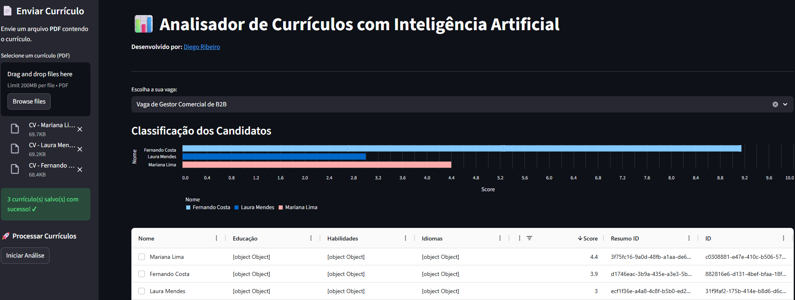
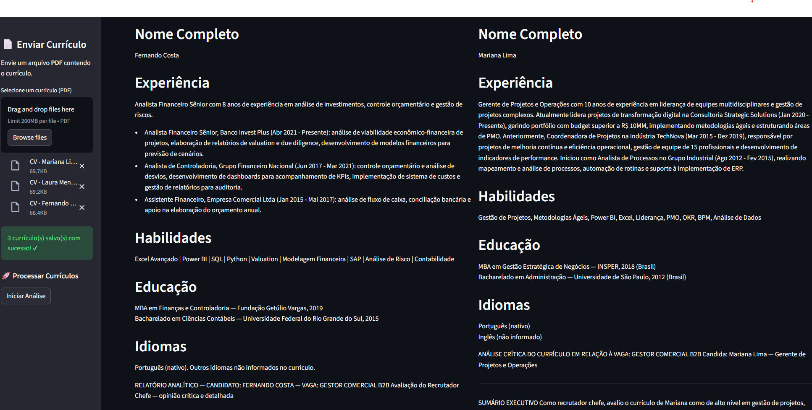
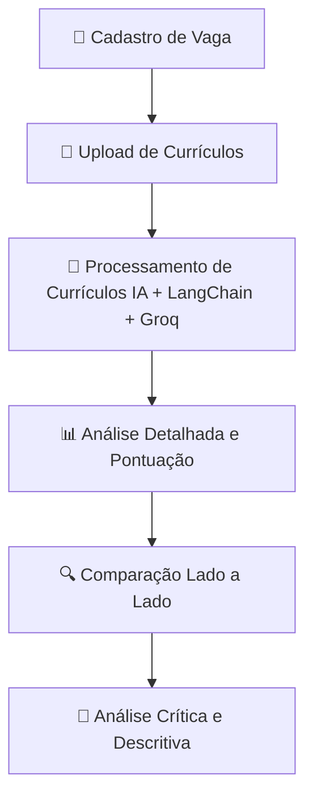

# Analisador de Currículos com IA

🔗 **Acesse o aplicativo aqui:** [iarecrutadora.streamlit.app](https://iarecrutadora.streamlit.app/)

Bem-vindo ao projeto **“Analisador de Currículos”**.
Este projeto permite analisar currículos de forma automatizada utilizando **Python**, **Streamlit** e **modelos de IA**, fornecendo resumos, pontuações e análises críticas para cada candidato com base em uma vaga específica.

Você também aprenderá a integrar APIs externas, como **Google Drive**, **LangChain** e **Groq API**, para processar e analisar currículos em larga escala.





---

## Fluxo do Sistema

O fluxo geral do projeto pode ser visualizado assim:



---

## Funcionalidades

- **Upload de Currículos em Lote**  
  Carregue e processe múltiplos currículos de uma vez, agilizando a análise em larga escala.  

- **Análise Detalhada de Currículos**  
  Avalie diferentes seções dos currículos (experiência, habilidades, educação, idiomas, pontos fortes e fracos), atribuindo pontuações de acordo com a relevância de cada candidato para a vaga.  

- **Comparação Lado a Lado**  
  Compare currículos simultaneamente, facilitando a identificação dos candidatos mais adequados.  

- **Geração de Análises Críticas**  
  Automatize a criação de análises críticas e descritivas que destacam os pontos fortes e fracos de cada candidato em relação à vaga.  

---

## Tecnologias Utilizadas

- **Python 3.11+**: Linguagem principal do projeto.  
- **Streamlit**: Framework para criar a interface web de forma rápida e interativa.  
- **ChatGPT (modelo 5-mini)**: Modelo de linguagem para resumir currículos e gerar pontuações.  
- **LangChain + Groq API**: Para processar, resumir e pontuar currículos de forma eficiente.  
- **Google Drive API**: Para ler e importar currículos diretamente do Drive.  
- **TinyDB**: Banco de dados NoSQL utilizado para armazenar informações.  
- **UV**: Gerenciamento de dependências e ambientes virtuais.  

---

## Pré-requisitos

- Python 3.11 ou superior  
- UV instalado globalmente  
- Chave da API da OpenAI  

---

## Configuração do Ambiente

Para o projeto funcionar corretamente, é necessário criar um arquivo `.env` na raiz do projeto com o seguinte conteúdo:

```env
OPENAI_API_KEY='sua chave da openai aqui'
```

> **Atenção:** Substitua `'sua chave da openai aqui'` pela sua chave de API da OpenAI.

## Instalação e Execução

### Passos para Instalação

1. Clone este repositório para o seu ambiente local:
   ```bash
   git clone https://github.com/asimov-academy/cv-recruter.git
   cd cv-recruter
   ```

2. Instale as dependências do projeto utilizando o Poetry:
   ```bash
   poetry install
   ```

### Execução no Linux

Para usuários Linux, há um script de build disponível na pasta `bin` que facilita a execução do projeto. Basta executar:

```bash
./bin/build.sh
```

O script inicia o Streamlit no endereço `0.0.0.0` e na porta `8585`.

### Execução no Windows

Para usuários Windows, a execução deve ser feita manualmente. Utilize o seguinte comando para iniciar o projeto:

```bash
uv run streamlit run analyser/app.py
```

Depois, acesse o projeto através do seu navegador no endereço:

```
http://localhost:8501
```

*Nota: A porta padrão do Streamlit é `8501` quando não especificada.*

## Uso

Após iniciar o projeto, você poderá:

1. Cadastrar novas vagas através da interface.
2. Fazer upload de currículos em lote para análise.
3. Visualizar a análise de cada currículo por vaga, com a possibilidade de comparar currículos.
4. Gerar análises críticas descritivas sobre os currículos em relação às vagas.

## Documentação do Sistema de Pontuação

O sistema de pontuação foi projetado para avaliar currículos com base em uma vaga específica. As seções avaliadas incluem:

- **Experiência (Peso: 30%)**
- **Habilidades Técnicas (Peso: 25%)**
- **Educação (Peso: 10%)**
- **Idiomas (Peso: 10%)**
- **Pontos Fortes (Peso: 15%)**
- **Pontos Fracos (Desconto de até 10%)**

Cada seção recebe uma pontuação de 0 a 10, com justificativas para as notas atribuídas. A pontuação final é uma média ponderada das avaliações, refletindo a adequação do candidato à vaga.
